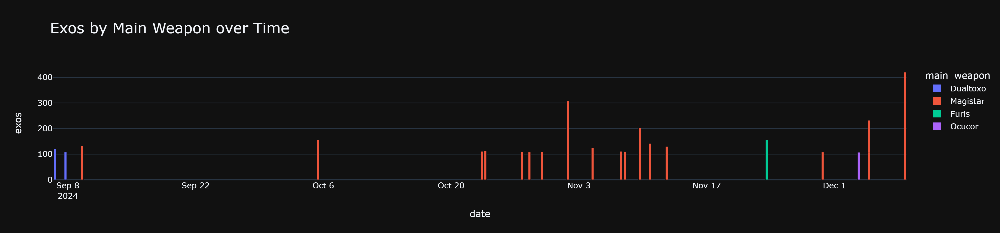

# Warframe Cascade Run Analysis

## Total Exolisers
- **2797** exolisers collected over **21** runs (~133 average).

## Exos by Warframe
| warframe   |   total_exos |   total_runs |   mean_exos_per_run |
|:-----------|-------------:|-------------:|--------------------:|
| Saryn      |         1593 |           13 |             122.538 |
| Ash        |         1048 |            7 |             149.714 |
| Loki       |          156 |            1 |             156     |

## Exos by Role
| role   |   total_exos |
|:-------|-------------:|
| Atk    |         1640 |
| Def    |         1157 |

## Exos by Main Weapon
| main_weapon   |   total_exos |
|:--------------|-------------:|
| Magistar      |         2304 |
| Dualtoxo      |          230 |
| Furis         |          156 |
| Ocucor        |          107 |

## Visualizations

---

*Report generated on 2024-12-04 19:50:10*
