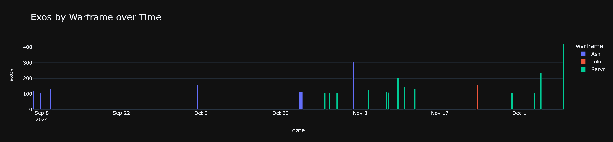

# Warframe Cascade Run Analysis

## Total Exolisers
- **1712** exolisers collected over **13** (~131 average).

## Exos by Warframe
| warframe   |   total_exos |   total_runs |   mean_exos_per_run |
|:-----------|-------------:|-------------:|--------------------:|
| Ash        |         1261 |            9 |             140.111 |
| Saryn      |          451 |            4 |             112.75  |

## Exos by Role
| role   |   total_exos |
|:-------|-------------:|
| Def    |          919 |
| Atk    |          793 |

## Exos by Main Weapon
| main_weapon   |   total_exos |
|:--------------|-------------:|
| Magistar      |         1482 |
| Dualtoxo      |          230 |

## Visualizations

---

*Report generated on 2024-11-06 17:53:12*
